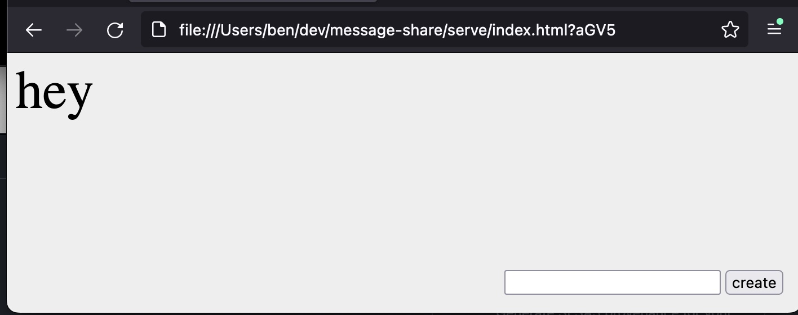

# Message sharing

A webpage (and file server) that allows you to create sharable links that render your message.

The message is stored in the URL encoded with base64 (so, not safe for spicy things)

